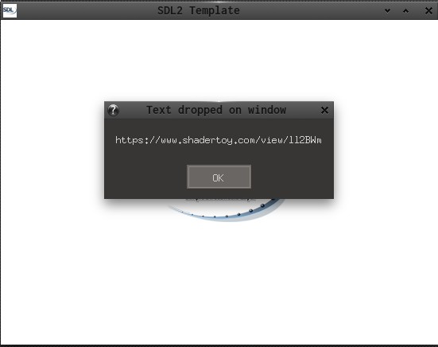

This is an C-SDL2 example.

It demonstrates how to receive...  

filenames & text  
  via [SDL_DropEvent](https://wiki.libsdl.org/SDL_DropEvent)

Useful links:  
[SDL2](https://www.libsdl.org/) [SDL-Discourse](https://discourse.libsdl.org)   [More SDl2 example Code](https://gist.github.com/Acry/baa861b8e370c6eddbb18519c487d9d8)  
[More C Example Code](https://gist.github.com/Acry/554e04bab3a2669a5ba2ecd4d673e875)  

Screenshot:  

